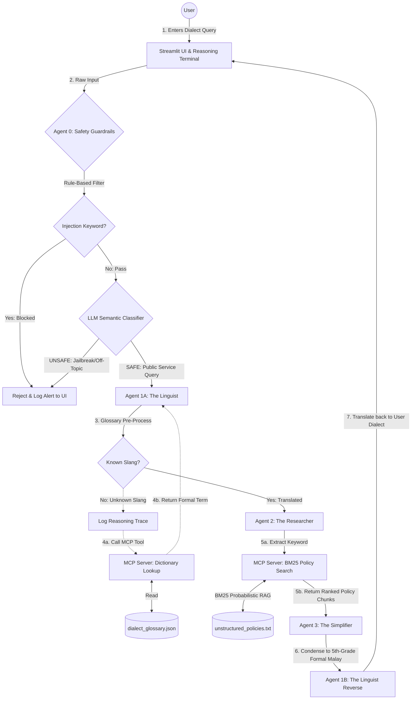

# 🌉 RakyatBridge: Multilingual Agentic Swarm for Public Services

> **"Jangan biar rakyat tertinggal kerana bahasa."**
> *"Don't let the people be left behind because of language."*

**The Boss Raid | Gemini Nexus: The Agentverse | 24-Hour Virtual Hackathon**
**Track A: Intelligence Bureau — Strategic Research Swarm**

RakyatBridge is an autonomous, multi-agent system designed to bridge the **"Information Gap"** in Malaysian public services. It accepts unstructured local dialects (Informal Malay, Kedah Dialect, SMS slang), translates them using a dual-layer NLP pipeline, securely retrieves complex government policies via local MCP servers using **BM25 probabilistic RAG**, and recursively simplifies the results to a 5th-grade reading level, then translates the answer *back* into the citizen's original dialect.

---

## 🧠 System Architecture Diagram (A2A Flow)

*Dotted lines = **Agentic Recovery Loop**. When the AI encounters unknown slang, it does not hallucinate, it autonomously pauses, logs a reasoning trace, and calls a local MCP dictionary tool to recover before proceeding.*



---

## 🤖 Agent Profiles

### 🛡️ Agent 0 - The Guardrail
| Field | Detail |
|---|---|
| **Role** | Safety classifier and gatekeeper |
| **Trigger** | Every query before any agent runs |
| **Layer 1** | Rule-based keyword filter (instant, zero LLM cost) which blocks known injection phrases like "abaikan arahan", "ignore previous", "jailbreak" |
| **Layer 2** | LLM semantic classifier using `system_instruction` which detects subtle off-topic or adversarial queries |
| **Fail Safe** | If JSON response is unparseable, defaults to UNSAFE (blocks) |
| **Output** | Dialect-appropriate rejection message per threat type |

---

### 🗣️ Agent 1A - The Linguist
| Field | Detail |
|---|---|
| **Role** | Dialect-to-formal-Malay translator |
| **Step 1** | Local glossary pre-processing via `dialect_glossary.json` (instant, no API cost) |
| **Step 2** | LLM translation for terms not in glossary |
| **Recovery Loop** | If LLM has low confidence, replies `UNKNOWN_WORD: [term]` → triggers MCP Dictionary Lookup → retranslates with context |
| **MCP Tool** | `tool_dictionary_lookup` |
| **Output** | Formal Malay translation |

---

### 🔍 Agent 2 - The Researcher
| Field | Detail |
|---|---|
| **Role** | Government policy retrieval agent |
| **Step 1** | Extracts core search keyword from formal query |
| **Step 2** | Calls `tool_policy_search`: BM25Okapi probabilistic RAG over `unstructured_policies.txt` |
| **RAG Method** | BM25 (Best Match 25): scores paragraphs by term frequency × inverse document frequency |
| **MCP Tool** | `tool_policy_search` |
| **Output** | Top 3 ranked policy paragraphs with BM25 relevance scores |

---

### 📝 Agent 3 - The Simplifier
| Field | Detail |
|---|---|
| **Role** | Policy synthesizer and plain-language writer |
| **Input** | Raw government policy text + original user query |
| **Task** | Answers ONLY from retrieved policy, simplifies to 5th-grade reading level |
| **Output** | 3 bullet points in formal Malay |

---

### 🔄 Agent 1B - The Linguist Reverse
| Field | Detail |
|---|---|
| **Role** | Formal-Malay-to-dialect translator |
| **Task** | Rewrites the formal answer in the user's original dialect/tone |
| **Goal** | Response feels like a friendly WhatsApp message, not a government letter |
| **Output** | Final dialect-friendly answer to citizen |

---

## ⚙️ Setup Instructions

### Prerequisites
- Python 3.10+
- A Google AI Studio API Key ([get one here](https://aistudio.google.com/apikey))

### 1. Clone the repository
```bash
git clone https://github.com/YOUR_USERNAME/rakyat-bridge-swarm.git
cd rakyat-bridge-swarm
```

### 2. Create and activate virtual environment
```bash
# Windows
python -m venv venv
venv\Scripts\activate

# Mac/Linux
python -m venv venv
source venv/bin/activate
```

### 3. Install dependencies
```bash
pip install -r requirements.txt
```

### 4. Configure environment variables
Create a `.env` file in the project root:
```env
GOOGLE_API_KEY=your_google_api_key_here
```
> ⚠️ **Never commit your `.env` file or API key to GitHub.**

### 5. Run the app
```bash
streamlit run app/main.py
```

Open your browser at `http://localhost:8502`

---

## 📁 Project Structure
```
rakyat-bridge-swarm/
├── agents/
│   └── swarm.py          # All 5 agents + orchestration logic
├── tools/
│   └── mcp_server.py     # MCP tools: BM25 RAG + dictionary lookup
├── data/
│   ├── dialect_glossary.json     # 3000+ Malay slang/dialect mappings
│   └── unstructured_policies.txt # Malaysian government policy corpus
├── app/
│   └── main.py           # Streamlit UI + reasoning trace panel
├── .env                  # API keys (never commit this)
├── requirements.txt
└── README.md
```

---

## 📦 requirements.txt
```
google-genai
streamlit
python-dotenv
rank-bm25
```

---

## 🛡️ Safety Features
- **Dual-layer guardrail**: rule-based + LLM semantic classifier
- **Fail-safe default**: unparseable responses are blocked, not passed
- **Threat-typed rejections**: `PROMPT_INJECTION`, `HACK_ATTEMPT`, `DATA_BREACH`, `ABUSE`, `OFF_TOPIC`
- **No hallucination on unknown slang**: recovery loop forces MCP lookup instead of guessing

---

## 🚀 Future Enhancements
- Upgrade BM25 to hybrid search (BM25 + sentence-transformers vector embeddings)
- Qdrant vector DB for large-scale policy corpus
- Google Model Armor integration for enterprise-grade guardrails
- Mobile deployment via Flutter

---

*Built with ❤️ for Malaysian rakyat | Gemini Nexus Hackathon 2026*
